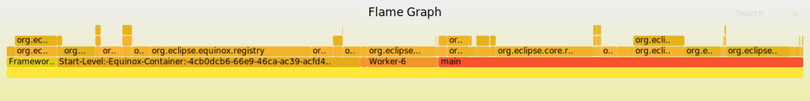

JFRBundleListener
=================

Bundle listener that writes out Java Flight Recorder events to track startup time of bundles.

For the write-up, see https://alblue.bandlem.com/2020/02/22/jfr-bundle-listener.html

This is derived from the talk given at
https://alblue.bandlem.com/2016/10/eclipsecon-books.html but at which point I
was not able to open-source the code other than that listed in the
presentation. Due to changes in the JFR API since being made public, and the
fact that JFR is available by default in Java 11, this code now makes sense as
a standalone open-source library.

Usage
-----

The bundle provides a synchronous `BundleListener` which will listen to
(subsequent) bundles started in the platform and record their being time of
starting and the end time of started, and record the events via Java Flight
Recorder.

The bundle needs to be installed into the OSGi framework or Eclipse platform,
and started, prior to other bundles being started. They typical way to do this
is to set up the bundle with a `startLevel` of 1, since frameworks that have
the start level mechanism provide a way to start up bundles in specific orders.
Alternatively, the framework may start up bundles in an order listed on the
configuration of which bundles are installed. Consult your application's
documentation for more details.

Recording
---------

To run a Java application and enable JFR recording, the following flags are
required on the JVM:

```sh Starting a Flight Recording
$ java -XX:StartFlightRecording=filename=/tmp/dump.jfr,dumponexit=true,disk=true ...
```

This will start the flight recorder as soon as the JVM is launched, writing out
to `/tmp/dump.jfr`, and flushing upon exit. The file can then be loaded into
Java Mission Control, or post-processed with the `JFRFlameGraph` executable to
produce stacks that can be consumed by FlameGraph:

```sh Processing a Flight Recording
$ java -jar JFRBundleListener.jar /tmp/dump.jfr /tmp/stacks.txt
$ git clone https://github.com/brendangregg/FlameGraph
$ FlameGraph/flamegraph.pl --hash --countname ms < /tmp/stacks.txt > /tmp/bundles.svg
```

This will result in images that look like:




Flame Graphs
------------

More information about flame graphs can be found on Brendan Gregg's page at
http://www.brendangregg.com/flamegraphs.html

The ordering of the pillars is alphabetical, and does not indicate start order.
However, higher layers start (and finish) before lower layers. In this case,
the start-up time for `org.eclipse.ui.trace` (963ms) is almost completely taken
up by the start-up time for `org.eclipse.core.runtime` (953ms), which in turn
is taken up by `org.eclipse.core.contenttype` (883ms) that depends upon
`org.eclipse.equinox.registry` (877ms). Together, this accounts for a little
less than 25% of the start-up time of a general Eclipse instance.

The bundles are split by thread; the `Start-Level` thread is the name given to
Equinox as it starts up; the `main` thread is used for most other start-up
purposes. Threads with `Worker-n` are largely created in the background on
separate threads, so themselves are unlikely to cause too much delay to
start-up.

Since the SVG is interactive, the items can be clicked and zoomed in, which can
help expand issues further.
